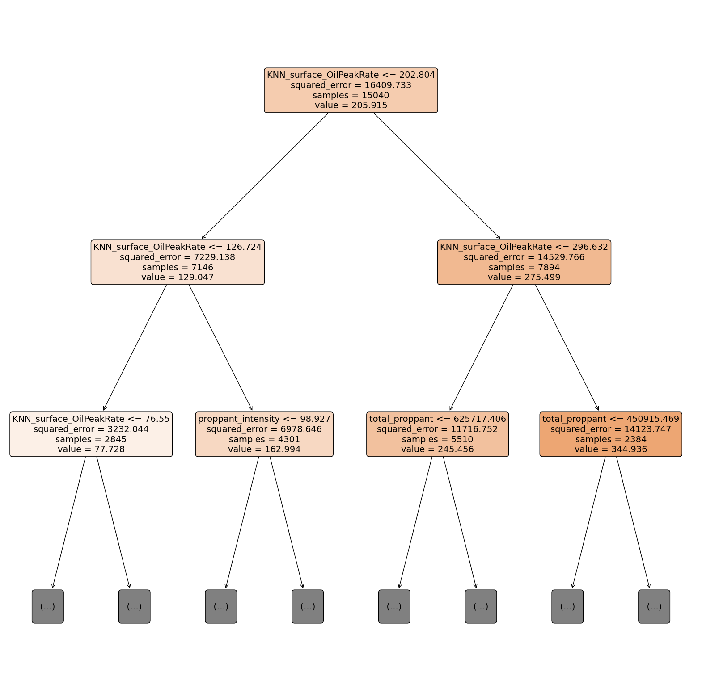

# Rice University Datathon 2024 Chevron Track (First Place)

## Team Members

- Alex Holzbach
- Arnav Burudgunte
- Chuk Uzowihe
- Evan Stegall

## Installation

 * Clone the repository
 ```bash
    git clone https://github.com/ajholzbach/Datathon_2024.git
```
 * Install the requirements
 ```bash
    pip install -r requirements.txt
```

## Usage
 * Run the app locally
 ```bash
    streamlit run Home.py
```

## Data Wrangling
### Data Cleaning
First, We read in the provided training data, which has 21 numerical features and 6 categorical features.

Several features have "Undefined", "Unknown", or "NaN" values. We replace "Undefined" and "Unknown" values with "NaN" values, and show them in the figure below.


We drop several columns which have meaningless or mostly null values:

 * Unnamed: 0 is the index value and is removed immediately

 * standardized_operator_name is a bookkeeping value defining operators

 * pad_id is an identifier for the pad, and is not useful for our purposes

 * number_of_stages, average_stage_length, average_proppant_per_stage, and average_frac_fluid_per_stage are mostly null

 * frac_type has categories with 0 or 1 members in the whole dataset

### Data Imputation
Before imputing, we save the rows with missing values in the target variables for later removal.

 * For categorical variables, we impute missing values with a 'Missing' category and then encode them with an Ordinal Encoder.

 * For numerical variables, we impute missing values using KNN imputation with 10 nearest neighbors.

### Outlier Removal

We start by removing all rows that originally had missing values in the target variables.

We then remove outliers in the target variables by calculating the interquartile range and removing all rows with values outside of 1.5 times the interquartile range.

## Exploratory Data Analysis
### Feature Correlation
We start by looking at the correlations between all of the features and each other, as well as the target variables.


As you can see, some of the features are highly correlated with each other and might be redundant.

### Categorical Trends

To look for initial trends, we plot boxplots of the categorical features, divided by category. Aside from outliers, the response is similarly distributed across categories. This explains why the importance of categorical variables is low in our final model.


### Spatial Analysis
We noticed that peak oil production exibhits spatial trends, high oil production is concentrated in a few areas of the map.


### Feature Engineering

Based on the spatial data, we hypothesized that the best predictor of peak oil production is the perfomance of wells around the target well.

In order to capture this, we created a KNN model to predict the peak oil production of a well base on the peak oil production of its neighbors. The output of this model is then fed as a feature into our final model.


We chose a K value of 15 for our final model, as it seemed to capture the spatial trends without much overfitting.

Besides the spatial data, we included two other engineered features in our final model:

 * The first is the birds-eye distance between the surface location of the well and the bottom hole.

 * The second is the estimated lateral length of the well, which is the distance between the bottom hole and the lateral toe.

## Final Model and Analysis
### Initial Approaches

We attempted quite a few different approaches to this problem, including:

 * Kernel Ridge Regression (RBF and Linear Kernels)

 * Random Forest Regression

 * KNN Regression

 * Decision Tree Regression

 * Gradient Boosting Regression

All of which greatly overfit or underfit the data, ultimately resulting in poor performance on the test set.

### Final Model

We finally chose to use AdaBoost Regression with a Histogram-based Gradient Boosting Tree as the base estimator.

The Histogram-based Gradient Boosting Tree is much faster than the traditional Gradient Boosting Tree, and is able to handle handles missing values elegantly.

The AdaBoost Regression algorithm improves the base estimator by forcing the base estimator to concentrate on harder cases as training goes on.

On 5 different train-test splits, we achieved an average RMSE of `78.698` on the test set and `21.264` on the training set.

After verifying the validation performance, we trained the final model on the entire dataset.

### Interpretation

Because AdaBoost fits an ensemble of regressors, it can be difficult to interpret. As a proxy, we fit and analyze an ordinary decision tree.

The feature importance plot shows that our KNN-based spatial figure is by far the most important, followed by `total_proppant` and other physical features.


We also visualize the first three layers of the decision tree, which demonstrate the importance of the KNN-based feature and `total_proppant`.


